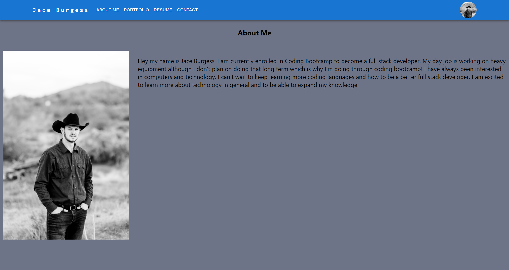
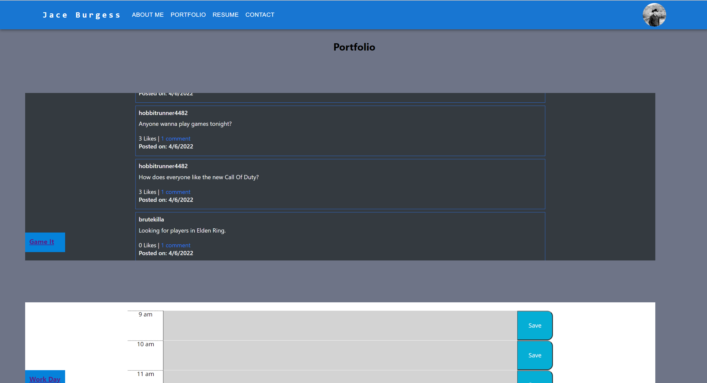

# Jace Awesome Portfolio

## Description
This is my portfolio that I created using React, HTML, CSS, and Material UI. There are still some functionst that need to be fine tuned but it is working overall. 

## Table of Contents

- [Installation](#installation)
- [Usage](#usage)
- [Credits](#credits)
- [License](#license)
- [Tests](#tests)
- [Questions](#questions)

## Installation
npm i

## Usage
In order to use this download and unzip the file, navigate to root of your desired directory, and run npm install.

## Walkthrough or Screenshot

## Credits
Jace Burgess, Bobbi Tarkani (tutor)

## License
A short and simple permissive license with conditions only requiring preservation of copyright and license notices. Licensed works, modifications, and larger works may be distributed under different terms and without source code.
[MIT](https://opensource.org/licenses/MIT)

## Tests
N/A

## Questions
- GitHub Account: Jburg1414
- Email Address: jburgess1414@gmail.com
